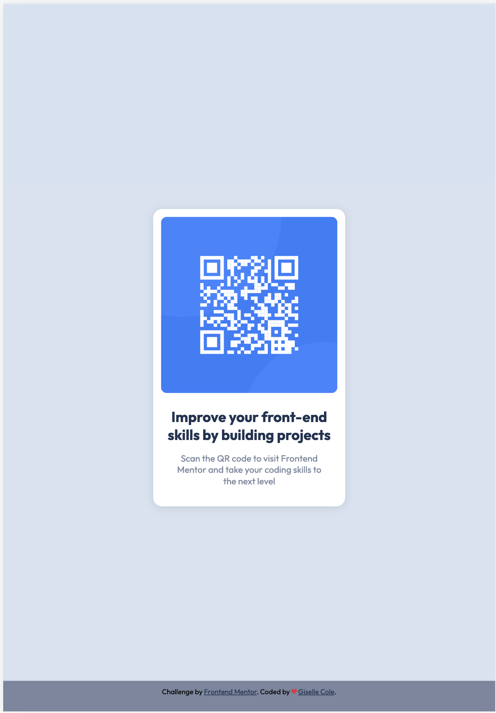

# Frontend Mentor - QR code component solution

This is a solution to the [QR code component challenge on Frontend Mentor](https://www.frontendmentor.io/challenges/qr-code-component-iux_sIO_H). Frontend Mentor challenges help you improve your coding skills by building realistic projects.

## Table of contents

- [Overview](#overview)
  - [Screenshot](#screenshot)
  - [Links](#links)
- [My process](#my-process)
  - [Built with](#built-with)
  - [What I learned](#what-i-learned)
  - [Useful resources](#useful-resources)
- [Author](#author)

## Overview

### Screenshot

- Mobile screenshot result
  

- Table screenshot result
  

- Desktop screenshot result
  

### Links

- Solution URL: [Git repo](https://github.com/gisellecole/QR-component-HTML-CSS-Frontend-Mentor)

- Live Site URL: [Git Page](https://gisellecole.github.io/QR-component-HTML-CSS-Frontend-Mentor/)

## My process

### Built with

- Semantic HTML5 markup
- CSS custom properties
- Used Sass
- Mobile-first workflow

### What I learned

I'm currently learning HTML and Sass, which are important tools for web development. In my recent project, I've been experimenting with Sass functions, which help me write cleaner and more efficient code.

In the project, I created a main section with a flexible layout that adjusts to different screen sizes. I used Sass variables to control the font family and background color, making it easy to maintain a consistent look.

Inside the main section, I added a container with cards. The cards have nice backgrounds, padding, and rounded corners. I also included an image inside each card, which looks great with a rounded border.

The text inside the cards is styled with different colors and padding, making it visually appealing. The headings and paragraphs stand out nicely.

At the bottom of the page, I created a footer with a centered layout. It has a pleasing background color and contains some attribution text. I used Sass functions to control the font size and adapt the layout to different devices.

This project has been a great learning experience for me. It has helped me understand how to structure HTML and apply styles using Sass. I'm excited to continue learning and exploring more techniques in HTML, Sass, and web development.

### Useful resources

- [Functions](https://css-tricks.com/snippets/sass/px-to-em-functions/) - This helped me to learn how to use functions in sass.

- [Build a Simple Website with HTML, CSS, JavaScript – Course for Beginners](hhttps://www.youtube.com/watch?v=krfUjg0S2uI&t=129s) - I recently came across an amazing tutorial on YouTube, that has truly motivated me to dive into web development. This tutorial not only introduced me to the world of Sass but also provided valuable insights into various other aspects of web development.

## Author

- Website - [Giselle Cole](https://github.com/gisellecole)
- Frontend Mentor - [@gisellecole](https://www.frontendmentor.io/profile/gisellecole)
- Twitter - [@giselle_c0le](https://www.twitter.com/giselle_c0le)
